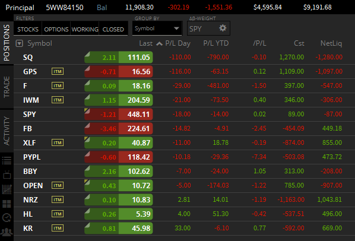
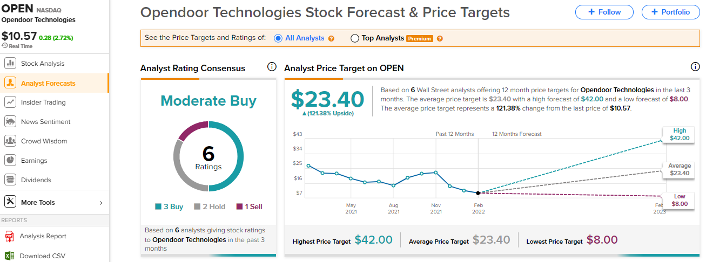
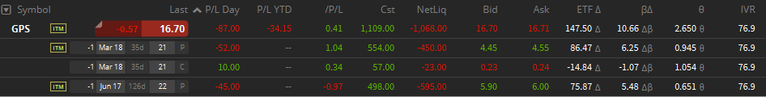
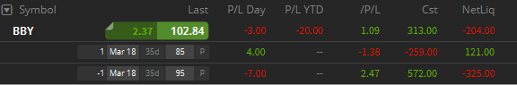
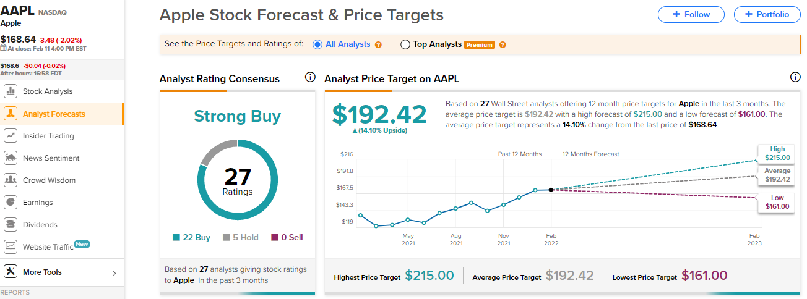
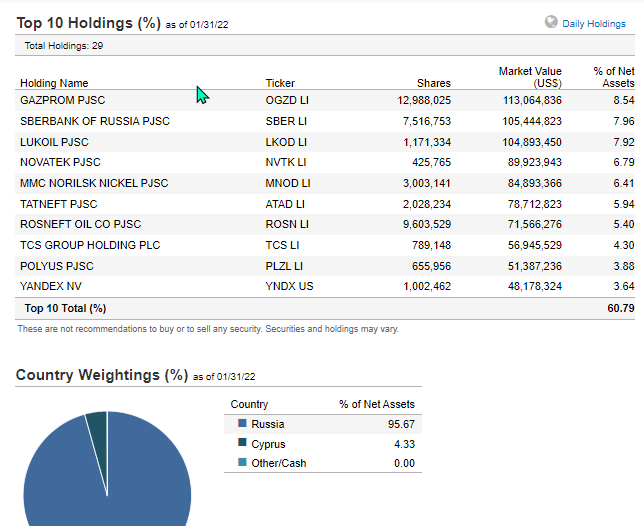
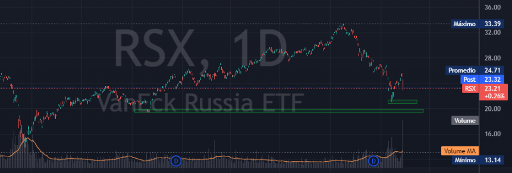

- [[Objetivos]] Me esta costando levantarme temprano, tengo que iniciar mi ayuno intermitente (esto me representa ahorro y salud) y hacer ejercicio.
- [[Opciones sobre Acciones]] , el objetivo es mantener las posiciones de opciones (a no ser que alguna de punto de cierre),  vigilar el BP (no puede pasar de 75%),
	- Cartera actual
		- {:height 305, :width 473}
	- [[XLF - Financial Select Sector SPDR Fund]] Es un ETF de Bancos sector financiero del SPY. tenemos una PCC que representa $ 874.
	- [[SQ - SQUARE]] Tenemos una posición que representa  1280 USD y ocupa una parte grande del BP 10.8% tan pronto se pueda cerrar.
	- comprar acciones de [[PYPL - Paypal]] o [[FB - meta]] si estas bajan mas de 10 USD.   [[OPEN Opendoor Technologies]], se tiene un contrato de opciones por 900 USD con strike 17 con vencimiento [[Jan 19th, 2024]]
		- {:height 49, :width 139}
	- [[GPS - Gap Inc]] Tengo tres posiciones, esto me representa $1068, el objetivo es mantener por el t  
	- [[BBY - Best Buy Co]] se tiene una una posición que representa 200, con una ocupacion 
	- [[F - Ford]]
	- [[AAPL - APPLE]] Estas acciones quiero tener para toda la vida, si todo se mantiene. asntes quiero valorizarla.
		- 
		- [[RSX - ]] Es un ETF de de Rusia.
			- {:height 389, :width 509}
			- {:height 192, :width 619}