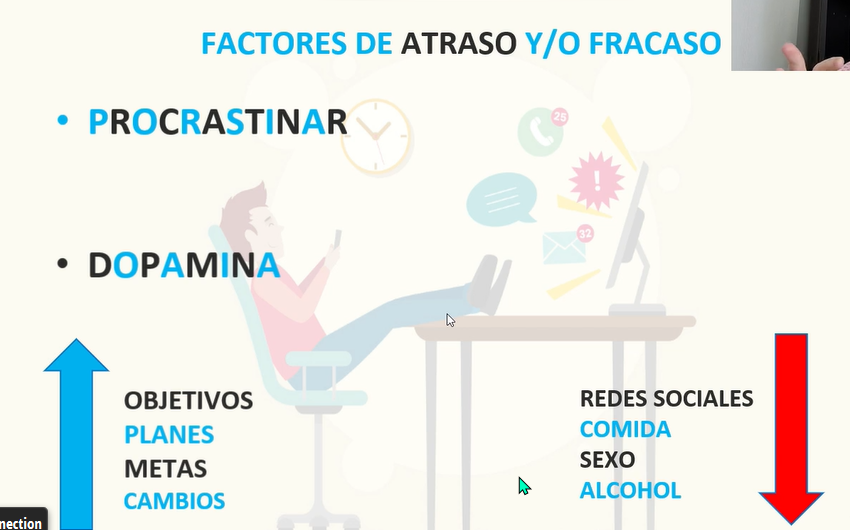

- ## Principios
	- Codicioso cuando los demás tienen miedo
	- Invertir cuando el VIX esta mas alto de 50 y si esta en 90 hacerlo sin duda [Grafico VIX](https://es.tradingview.com/chart/y3tY2X4B/) .
	- Estar pendiente del índice del miedo y la codicia [fear y gear](https://money.cnn.com/data/fear-and-greed/)
	- Valorar la empresa antes de comprar, si no por lo menos Mirar [Tiranks](https://www.tipranks.com)
-
- ## Bitacora
	- Vi este video de invertir desde cero [video](https://youtu.be/NWgZHNpI25Y)
- ## Psicologia y Motivación en la inversion
	- Codicioso cuando los demás tienen miedo.
- ### Relacion con la dopamina
	- inversión corto plazo , se requiere demasiada Dopamina
	- Inversión largo plazo, se requiere menos Dopamina,
		- 
- Como mejorar los niveles de dopamina, con meditación, actividad física, lectura, ayuno intermitente, metodo win hof.
- La disciplina y la constancia
-